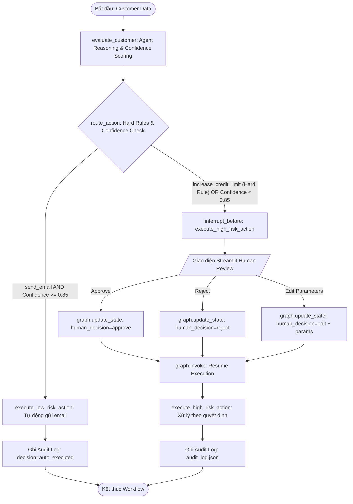

# Lab 27: Xây Dựng Hệ Thống Agent Human-in-the-Loop (HITL)

Hệ thống đánh giá rủi ro khách hàng rời bỏ (**Customer Churn Risk Assessment**) kết hợp **LangGraph**, **Pydantic**, **Streamlit** và cơ chế **Human-in-the-Loop (HITL)** với chính sách định tuyến an toàn, tạm dừng luồng (`interrupt_before`), phê duyệt/từ chối/chỉnh sửa bởi con người và nhật ký kiểm toán bất biến (**Audit Trail**).

---

## 📑 Mục lục
1. [Kiến trúc & Sơ đồ luồng hoạt động](#-kiến-trúc--sơ-đồ-luồng-hoạt-động)
2. [Cấu trúc thư mục](#-cấu-trúc-thư-mục)
3. [Đặc tả kỹ thuật (Core Components)](#-đặc-tả-kỹ-thuật-core-components)
4. [Hướng dẫn cài đặt & Chạy ứng dụng](#-hướng-dẫn-cài-đặt--chạy-ứng-dụng)
5. [Quy tắc định tuyến & Chính sách an toàn](#-quy-tắc-định-tuyến--chính-sách-an-toàn)
6. [Hướng dẫn sử dụng giao diện Streamlit (Approve, Reject, Edit)](#-hướng-dẫn-sử-dụng-giao-diện-streamlit)
7. [Giải đáp chi tiết 3 câu hỏi phản biện (Reflection Questions)](#-giải-đáp-chi-tiết-3-câu-hỏi-phản-biện-reflection-questions)
8. [Kiểm thử tự động & Báo cáo kết quả](#-kiểm-thử-tự-động--báo-cáo-kết-quả)

---

## 🏛️ Kiến trúc & Sơ đồ luồng hoạt động

Luồng làm việc tích hợp cơ chế đánh giá, định tuyến theo độ tự tin, ghi đè chính sách bắt buộc và can thiệp của con người:



---

## 📂 Cấu trúc thư mục

```text
c:\Users\admin\Lab-27-Agent-Human-in-the-Loop-2A202601148/
├── app.py              # Giao diện Streamlit Human Approval (Approve, Reject, Edit, Audit View)
├── graph.py            # LangGraph Workflow, GraphState, Nodes, Routing, MemorySaver Checkpointer
├── models.py           # Pydantic Schemas (AuditEntry, CustomerProfile) & AuditLogger Helper
├── audit_log.json      # File lưu trữ nhật ký kiểm toán nối tiếp (Append-only Audit Trail)
├── demo_cli.py         # Kịch bản chạy thử nghiệm workflow qua giao diện dòng lệnh (CLI Demo)
├── test_workflow.py    # Bộ kiểm thử tự động toàn diện (Pytest Test Suite)
├── requirements.txt    # Danh sách thư viện phụ thuộc
└── README.md           # Tài liệu hướng dẫn & giải đáp phản biện chi tiết
```

---

## ⚙️ Đặc tả kỹ thuật (Core Components)

### 1. Persistent State (`GraphState`)
Định nghĩa trong `graph.py` sử dụng `TypedDict`:
```python
class GraphState(TypedDict):
    customer_id: str
    proposed_action: str
    confidence_score: float
    reasoning: str
    human_decision: Optional[str]        # 'approve' | 'reject' | 'edit' | None
    action_details: Optional[Dict[str, Any]]
    execution_status: Optional[str]     # 'pending_approval' | 'auto_executed' | 'executed' | 'aborted'
    customer_data: Optional[Dict[str, Any]]
    reviewer_id: Optional[str]
```

### 2. Pydantic Audit Schema (`AuditEntry`)
Định nghĩa trong `models.py`:
```python
class AuditEntry(BaseModel):
    timestamp: str = Field(default_factory=lambda: datetime.now().isoformat())
    agent_id: str = "churn-risk-agent"
    action: str
    confidence: float
    reviewer_id: str
    decision: str  # 'approve' | 'reject' | 'edit' | 'auto_executed'
    customer_id: Optional[str] = None
    details: Optional[Dict[str, Any]] = None
```

### 3. Checkpoint & Interruption
Sử dụng `MemorySaver` để duy trì toàn vẹn dữ liệu khách hàng trong lúc workflow tạm dừng chờ con người:
```python
from langgraph.checkpoint.memory import MemorySaver

memory = MemorySaver()
graph = builder.compile(
    checkpointer=memory,
    interrupt_before=["execute_high_risk_action"]
)
```

---

## 🚦 Quy tắc định tuyến & Chính sách an toàn

| Quy tắc | Điều kiện | Điểm tin cậy (Confidence) | Đích đến (Routing Target) | Hành vi |
| :--- | :--- | :--- | :--- | :--- |
| **Rule 1: Hard Policy Override** | `action == 'increase_credit_limit'` | Bất kỳ (Kể cả `0.99`) | `execute_high_risk_action` | **Tạm dừng bắt buộc** chờ Operator duyệt |
| **Rule 2: Auto-Execute** | `action == 'send_email'` (Low-risk) | $\ge 0.85$ | `execute_low_risk_action` | **Tự động thực thi** và ghi audit log |
| **Rule 3: Escalate / Suggest** | `action == 'send_email'` hoặc hành động khác | $< 0.85$ | `execute_high_risk_action` | **Tạm dừng leo thang** để con người thẩm định |

---

## 🚀 Hướng dẫn cài đặt & Chạy ứng dụng

### 1. Cài đặt môi trường & dependencies
```bash
pip install -r requirements.txt
```

### 2. Chạy giao diện Web Streamlit
```bash
streamlit run app.py
```
*Truy cập trình duyệt tại:* `http://localhost:8501`

### 3. Chạy Demo qua giao diện dòng lệnh (CLI)
```bash
python demo_cli.py
```

### 4. Chạy bộ kiểm thử tự động (Pytest)
```bash
python -m pytest test_workflow.py -v
```

---

## 🖥️ Hướng dẫn sử dụng giao diện Streamlit

1. **Khởi tạo kịch bản:**
   - Tại thanh bên trái (Sidebar), nhập mã `Reviewer ID` (ví dụ: `operator_01`).
   - Chọn hồ sơ mẫu (`CUST001`, `CUST002`, `CUST003`, `CUST004`) hoặc chọn *Nhập tùy chỉnh* để tạo hồ sơ mới.
   - Bấm **"🚀 Chạy Đánh Giá (Trigger Workflow)"**.

2. **Xử lý trên Action Proposal Card:**
   - **Tự động thực thi (Auto-Executed):** Nếu là hành động rủi ro thấp và điểm tin cậy $\ge 0.85$, hệ thống hiển thị thông báo thành công màu xanh và tự động cập nhật nhật ký kiểm toán.
   - **Tạm dừng chờ duyệt (Pending Approval):** Nếu là hành động tăng hạn mức hoặc điểm tin cậy $< 0.85$, Action Card màu vàng/đỏ sẽ xuất hiện với đầy đủ lý do phân tích (Reasoning) và thanh đo độ tự tin.
   - **3 Lựa chọn hành động:**
     - **✅ Approve (Phê duyệt):** Giữ nguyên đề xuất của AI và thực thi.
     - **❌ Reject (Từ chối):** Hủy bỏ hành động nguy hiểm.
     - **✏️ Edit (Chỉnh sửa):** Mở bảng điều chỉnh tham số (như giảm mức tăng hạn mức từ 30 triệu xuống 10 triệu hoặc đổi loại hành động), sau đó bấm *Xác nhận & Thực thi*.

3. **Xem Audit Trail:**
   - Chuyển sang tab **"📜 Audit Trail"** để theo dõi toàn bộ lịch sử, thống kê lượt duyệt/hủy/sửa và tải file JSON báo cáo.

---

## 💡 Giải đáp chi tiết 3 câu hỏi phản biện (Reflection Questions)

### Câu 1: `interrupt_before` hay `interrupt_after` khi Human cần rewrite customer retention email?
- **Lựa chọn:** **`interrupt_after=["generate_retention_email"]`** (hoặc `interrupt_before=["route_or_send_node"]`).
- **Giải thích:**
  1. Mục tiêu là cho phép con người chỉnh sửa (rewrite) nội dung email **đã được sinh ra bởi AI**. Do đó, node `generate_retention_email` bắt buộc phải chạy xong trước để nội dung email nháp (draft text) xuất hiện trong `GraphState`.
  2. `interrupt_after` sẽ dừng graph ngay sau khi node sinh email hoàn thành. Lúc này, giao diện Streamlit có thể đọc bản nháp từ State, hiển thị vào ô soạn thảo cho nhân viên chỉnh sửa, cập nhật lại vào State thông qua `graph.update_state()`, và sau đó resume graph để gửi đi.
  3. Nếu sử dụng `interrupt_before=["generate_retention_email"]`, graph sẽ dừng **trước** khi email được tạo, dẫn đến việc con người không có nội dung nháp để review.

---

### Câu 2: Giải pháp ngăn chặn Alert Fatigue khi có 500 actions `send_email` mỗi ngày bị kẹt ở confidence `0.82` (dưới `0.85`)
Để khắc phục hội chứng mệt mỏi vì cảnh báo (**Alert Fatigue**) cho nhân viên, cần kết hợp giải pháp kiến trúc và cải tiến UI/UX:

1. **Về mặt Kiến trúc & AI Calibrations (Architecture & Policy):**
   - **Adaptive Thresholding (Phân tầng ngưỡng linh hoạt):** Áp dụng ngưỡng dựa trên phân khúc rủi ro. Với hành động `send_email` mang tính chăm sóc khách hàng thông thường, ngưỡng có thể điều chỉnh xuống `0.80`; chỉ áp dụng ngưỡng khắt khe `0.85` - `0.90` cho email có đính kèm ưu đãi tài chính lớn.
   - **Few-shot Prompting & Calibrated Confidence:** Bổ sung dữ liệu mẫu vào prompt để AI tự tin hơn trong các trường hợp dữ liệu biên, nâng confidence trung bình từ `0.82` lên trên `0.88`.
   - **Ensemble / Validator Cross-Check:** Sử dụng thêm mô hình phân loại phụ (ví dụ rule-based classifier). Nếu cả 2 mô hình cùng phân loại an toàn thì kích hoạt *Auto-Execute*.

2. **Về mặt Giao diện & Trải nghiệm (UI/UX):**
   - **Batch Approval (Duyệt theo lô):** Cung cấp giao diện bảng tổng hợp cho phép nhân viên chọn hàng loạt (Select All) các email có cùng lý do và bấm *“Duyệt tất cả 50 email”* chỉ với 1 cú click.
   - **Review by Exception / Diff Highlighting:** Chỉ làm nổi bật các trường thông tin không rõ ràng dẫn đến điểm phạt tự tin (ví dụ: bôi vàng trường "Thu nhập chưa xác thực"), giúp reviewer đưa ra quyết định trong vòng 3 giây.
   - **Auto-Approve with SLA Timeout:** Thiết lập chính sách: nếu email rủi ro thấp không bị phản đối trong vòng 4 tiếng làm việc, hệ thống tự động phát hành.

---

### Câu 3: Rủi ro của LLM Self-Confidence & Phương pháp Calibrate trước bước Routing
- **Tại sao LLM Self-Confidence nguy hiểm?**
  1. **Ảo giác và Overconfidence (Tự tin thái quá):** LLM là mô hình xác suất từ ngữ, thường có xu hướng trả về điểm tự tin rất cao (`0.95` - `0.99`) ngay cả khi lập luận dựa trên dữ liệu giả định hoặc suy luận logic sai lệch.
  2. **Yếu kém về tính toán tài chính chính xác:** LLM không được thiết kế cho việc kiểm tra số dư và công thức tính hạn mức tín dụng tuyệt đối. Việc tin tưởng mù quáng vào điểm tự tin của LLM có thể dẫn đến rủi ro nợ xấu và vi phạm quy định pháp lý ngân hàng.

- **Phương pháp Calibrate điểm số trước bước Routing:**
  1. **Tool-Grounded Deterministic Verification (Xác thực bằng Tool toán học):**
     - Tích hợp một Python validation function độc lập kiểm tra trực tiếp dữ liệu Core Banking:
       $$\text{Limit}_{\text{max}} = \text{TOI} \times \text{Multiplier}$$
     - Nếu đề xuất của LLM vượt ngưỡng an toàn này, điểm confidence tự động bị ép về `0.0` và kích hoạt Hard Policy Violation.
  2. **Verbalized Calibration & Platt Scaling:**
     - Huấn luyện một mô hình hồi quy logistic nhẹ (Platt Scaling) hoặc Isotonic Regression trên tập validation để ánh xạ điểm confidence thô của LLM về xác suất thực tế (true calibrated probability).
  3. **Multi-Agent / Self-Consistency Sampling:**
     - Thực hiện sinh 3 lần suy luận độc lập hoặc đưa qua một **Risk Officer Critic Agent**. Độ tự tin cuối cùng được tính bằng tỷ lệ đồng thuận giữa các lượt đánh giá.

---

## 🧪 Kiểm thử tự động & Báo cáo kết quả

Tất cả các ca kiểm thử trong `test_workflow.py` được thực thi và đạt tỷ lệ thành công **100%**:

```text
============================= test session starts =============================
platform win32 -- Python 3.11.9, pytest-9.1.0, pluggy-1.6.0
collected 7 items

test_workflow.py::test_hard_policy_rule_override PASSED                  [ 14%]
test_workflow.py::test_auto_execute_low_risk_high_confidence PASSED      [ 28%]
test_workflow.py::test_escalation_low_confidence PASSED                  [ 42%]
test_workflow.py::test_human_approve_flow PASSED                         [ 57%]
test_workflow.py::test_human_reject_flow PASSED                          [ 71%]
test_workflow.py::test_human_edit_flow PASSED                            [ 85%]
test_workflow.py::test_audit_log_multiple_history_integrity PASSED       [100%]

============================== 7 passed in 1.58s ==============================
```

---

## 🔒 Cam kết bảo mật
- Repository không chứa bất kỳ API key, Access token, mật khẩu, private key hoặc thông tin nhạy cảm.
- Tất cả cấu hình và dữ liệu mẫu được cô lập và tuân thủ nguyên tắc an toàn dữ liệu ngân hàng.